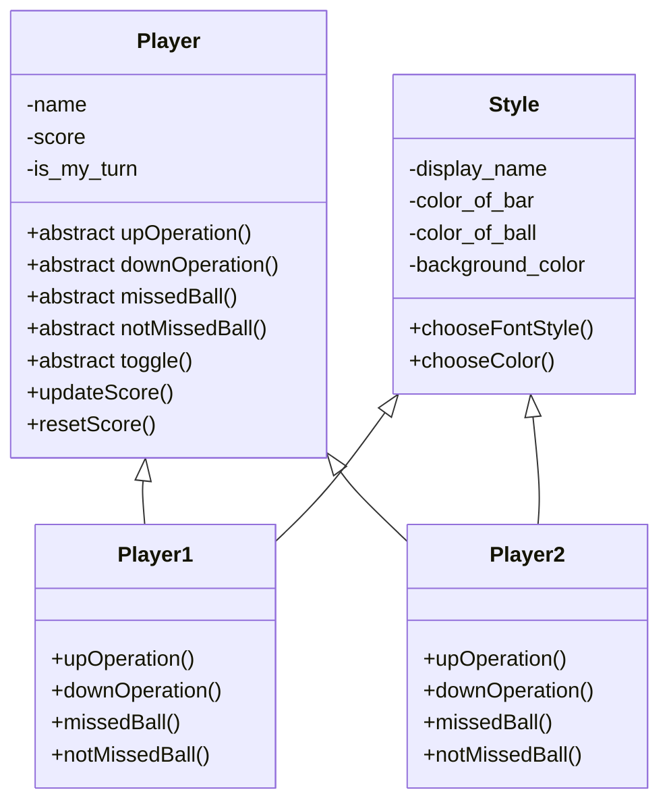
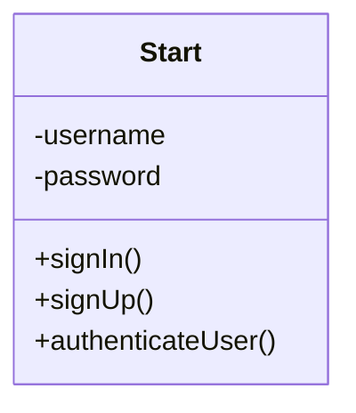
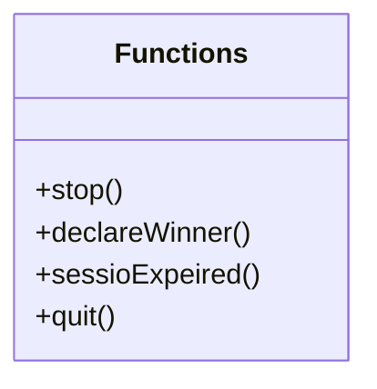

```mermaid
classDiagram
      class Player
      Player <|-- Player1
      Player <|-- Player2

      Player : -name
      Player : -score
      Player : -is_my_turn
      Player : +abstract upOperation()
      Player : +abstract downOperation()
      Player : +abstract missedBall()
      Player : +abstract notMissedBall()
      Player : +abstract toggle()
      Player : +updateScore()
      Player : +resetScore()

      class Style
      Style <|-- Player1
      Style <|-- Player2
   
      Style : -display_name 
      Style : -color_of_bar
      Style : -color_of_ball
      Style : -background_color
      Style : +chooseFontStyle()
      Style : +chooseColor()
  
      Player1 : +upOperation()
      Player1 : +downOperation()
      Player1 : +missedBall()
      Player1 : +notMissedBall()

      Player2 : +upOperation()
      Player2 : +downOperation()
      Player2 : +missedBall()
      Player2 : +notMissedBall()

```

```mermaid
classDiagram
      class Start
      
      Start : -username
      Start : -password
      Start : +signIn()
      Start : +signUp()
      Start : +authenticateUser()
    
```

```mermaid
classDiagram
      class Functions
      
      Functions : +stop()
      Functions : +declareWinner()
      Functions : +sessioExpeired()
      Functions : +quit()
```